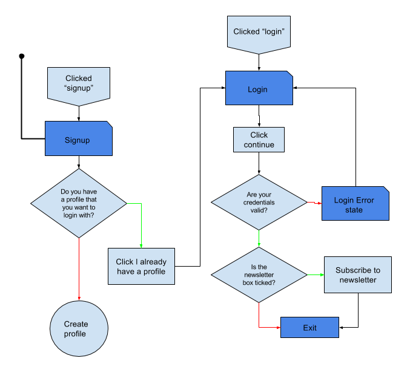
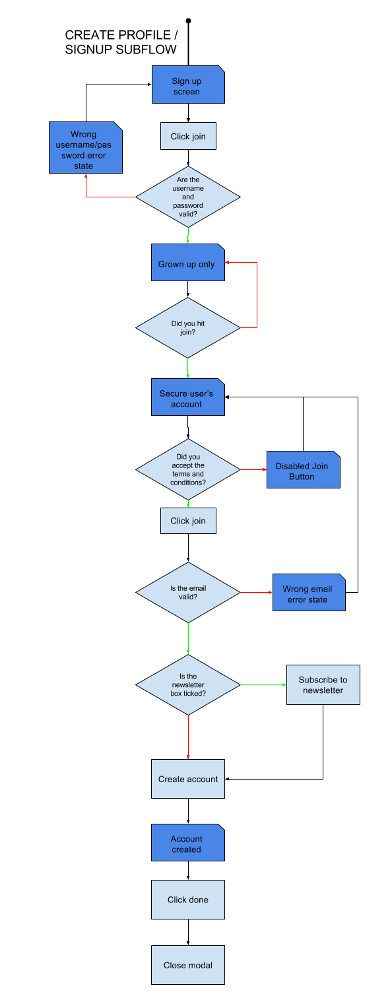
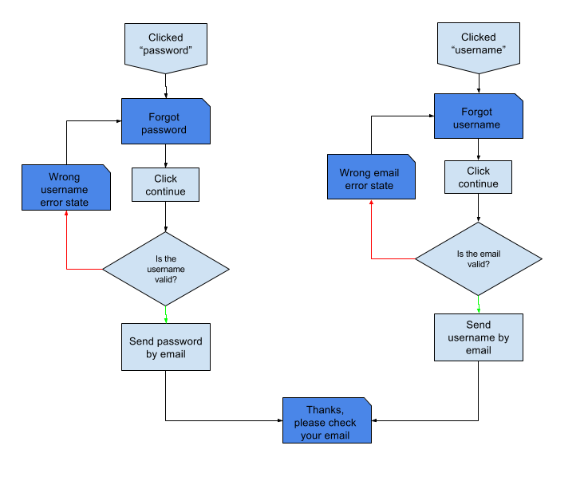

# \<kwc-auth\>

## Purpose
Front end for Kano&#39;s authentication flow.

## Properties
  * assetsPath: Path for assets used during the auth flow.
  * defaultFirstName: Default user first name. This is used during signup if no first name is given
  * errors: Keeps track of error messages.
  * email: Input value.
  * firstName: Input value.
  * isForceSignup: Flags if modal can be closed or not. If `isForceSignup` is `true` then the `kwc-modal` shouldn't be closable.
  * newsletter: Flags if user wants to subscribe to newsletter.
  * opened: Flags modal is opened
  * password: Input value.
  * processing: Flags if component is waiting an answer from server or parent component.
  * terms: Flags if user has accepted terms and conditions.
  * username: Input value.
  * worldUrl: Kano world URL.
 
 If `assetsPath` is given the modal will look for a motif icon at `${assetsPath}/avatar/judoka-face.svg` and an arrow icon at `${assetsPath}/icons/link-arrow.svg` so you need to provide those files.

## API
### kwc-auth#close()
A [ronseal](http://media-assets-02.thedrum.com/cache/images/thedrum-prod/public-news-tmp-56351-1806130_orig--default--300.jpg) function. It does what it says on the tin.
### kwc-auth#open([defaultview])
Open the `kwc-auth` modal. The default view is the [`login`](#login) view. This can be overidden if a valid view name is passed.
#### Arguments
* defaultview: one of `login`, `signup`, `grownups`, `password-reset` or `username-reminder`.
### kwc-auth#reset()
Reset the internal state of the auth modal. Essentially 
```js
kwc-auth.errors = {};
kwc-auth.firstName = null;
kwc-auth.username = null;
kwc-auth.password = null;
kwc-auth.email = null;
kwc-auth.terms = true;
kwc-auth.newsletter = false;
```
### kwc-auth#show*
Router helper functions that allow an external component to trigger a view change to the desired view.
* `showLogin()`
* `showSignup()`
* `showGrownup()`
* `showEmail()`
* `showDone()`
* `showPasswordReset()`
* `showResetConfirmation()`
* `showUsernameReminder()`

## Auth Flows and Views
This component is very specific to the authentication flow as it is currently specified for the `kano` apps. It does not contain any logic for completing the authentication flows, that is defered the the context in which the component is used. The views are for collecting the relevant user data so any parent (probably app specific) component can complete the communicaiton with the api and process any responses.
### Login | Signup
The first flow is for authenticating a user. (__NOTE: This flow may be updated before this doc is!__). Either a user authenticates an existing account or creates a new account and is logged in on completion.

<table>
    <tr>
        <td style="vertical-align:top"></td>
        <td></td>
    </tr>
</table>

The `kwc-auth` component implements views for [login](#login) and [signup](#signup) with links between the two.
#### login
* Fields: username, password.
* On submit event: [`login`](#login).
#### signup
* Fields: firstname, username, password.
* On submit event: [`submit-signup-info`](#submit-signup-info).
#### grownups
* Fields: email.
* On submit event: [`submit-signup-email`](#submit-signup-email).

### Forget credentials
The `kwc-auth` component implements two views to allow a user to enter information in order to recover forgotten credentials. Username recovery flow accepts a valid email address and password recovery asks for a username.



#### password-reset
* Fields: username.
* On submit event: [`forgot-password`](#forgot-password).
#### username-reminder
* Fields: email.
* On submit event: [`forgot-username`](#forgot-username).
## Events
This component fires the following custom events:

### cancel
This event is fired when the modal close button or the skip button are clicked.
### change-*
`kw-auth` exposes the `on-change-[email|firstname|password|username]` events for the input fields on the auth forms. This allows for parent components to apply context specific validations on user inputs. For example we could check username availability as a user types.
```js
const authElem = document.querySelector('#auth');
authElm.addEventListener('change-username', (e) => {

    if(this.delayTimer){
        clearTimeout(this.delayTimer);
    }
    this.delayTimer = setTimeout((function(value) {
        return fetch(`${API_URL}/users/username/${value}`)
            .then((res) => {
                if(res.ok){
                    authElm.errors.username = "This one is already taken."
                }
            });
        },
    }).bind( this, e.detail ), 1000);
});
```
The `detail` property of the event will contain only the current value of the targeted input.
### done
Fired when the `done` button is clicked on the final auth modal view. No data is passed.
### forgot-password
The event is passed the following detail:
```js
{
    type: 'object',
    properties: {
        username: {
            type: 'string'
        }
    }
}
```
### forgot-username
The event is passed the following detail:
```js
{
    type: 'object',
    properties: {
        password: {
            type: 'string'
        }
    }
}
```
### login
The event is passed the following detail:
```js
{
    type: 'object',
    properties: {
        username: {
            type: 'string'
        },
        password: {
            type: 'string'
        }
    }
}
```
### skip
The event is passed no data and is followed by a [`cancel`](#cancel) event.
### submit-signup-email
The event is passed the following detail:
```js
{
    type: 'object',
    properties: {
        firstName: {
            type: 'string'
        },
        username: {
            type: 'string'
        },
        password: {
            type: 'string'
        },
        email: {
            type: 'string',
            format: 'email'
        },
        newsletter: {
            type: 'boolean'
        }
    }
}
```
### submit-signup-info
The event is passed the following detail:
```js
{
    type: 'object',
    properties: {
        firstName: {
            type: 'string'
        },
        username: {
            type: 'string'
        },
        password: {
            type: 'string'
        }
    }
}
```
## Installation
 * Clone this repository.
 * Run `bower i`
 * Make sure you have the [Polymer CLI](https://www.npmjs.com/package/polymer-cli) installed. Then run `polymer serve` to serve your element locally.
## Running Tests

```
$ polymer test --skip-plugin junit-reporter
```
